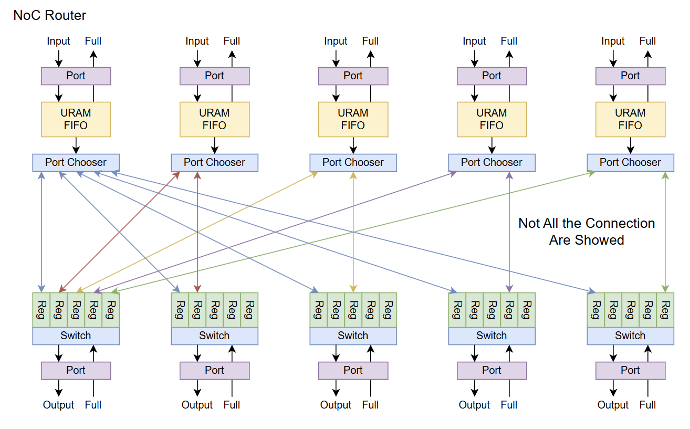
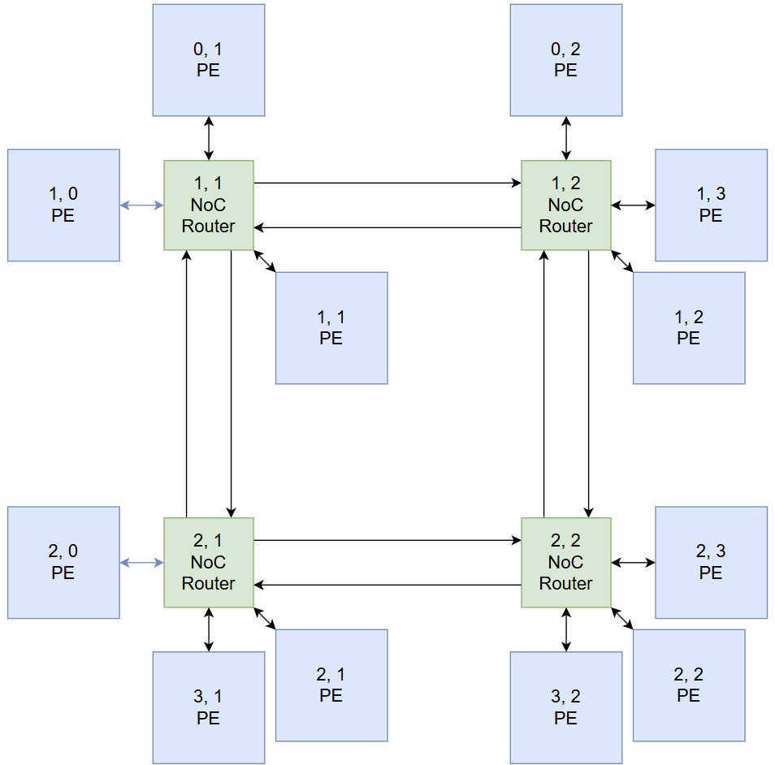
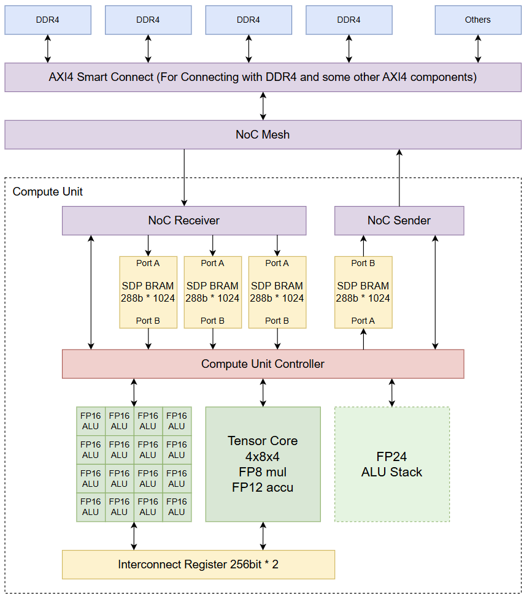
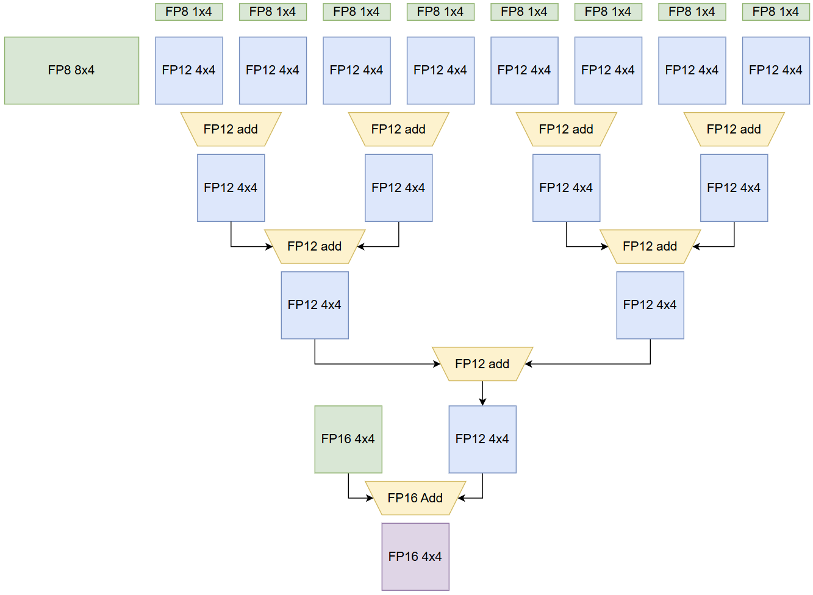
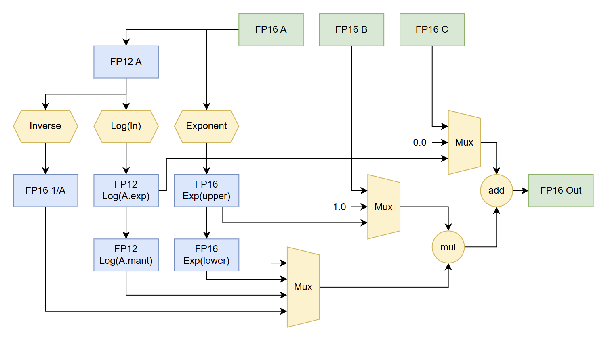

# [WIP] HakuTPU

An AI accelerator implemenation for Xilinx FPGA

This project based on Xilinx Ultrascale+ FPGA's, utilize their DSP48E2 tile to do efficient FP8 matmul. Than implement vectorized ALU for activation(or related operation).

This project is more for fun, not for real usage. But if anyone have interests to make it work, feel free to open PR.

## Introduction

All the resource utilization estimation in this section is based on XCVU13P.
Which have 1728k LUTs, 3456K FFs and 12288 DSPs.

### Fundamental Components

* [ ] NoC

  * [X] Router
  * [ ] AXI4 to NoC
    * [ ] Stream
    * [ ] Lite
      * [ ] Master
      * [ ] Slave
    * [ ] Full
      * [ ] Master
      * [ ] Slave
  * [ ] Client Example
* [ ] Global Controller
* [ ] Unit Controller
* [X] 288bit buffer by BRAM
* [X] Tensor Core: 4x8x4 FP8 mul FP12 accu

  * [X] 32 x 1x4 FP8VectorMul
  * [X] 32 x 4+4 FPaddition
* [X] Fast FP16 ALU Array

  * [X] efficient FP16 FMA
  * [X] FP12 inversion
  * [X] FP12 exp/log
* [ ] High Precision ALU stacks

  * Support 2 FP24 precision input and 1 FP24 precision output per cycle.
  * Support division, log, exp, sqrt, cos, sin, tanh with one cycle throughput
  * *Low Priority, may be some addon module around global controller*

### NoC

To connect 32 or more Compute Unit together, use bus-based system need very complex interconnect system (such as AXI4 interconnect) which need tons of resources and hard to implement/manage.

Therefore we decided to design our own NoC system.

#### Features

* High bandwidth
* 2d mesh network
* 1cycle through put
* artbitration
* back preasure

| NoC Router Arch | 2D mesh example |
| ---------------------------------------------- | ---------------------------------------------- |
|  |  |

### Compute Unit

| Overall Arch                                   | Tensor Core Design                             | FP16 ALU Design                                |
| ---------------------------------------------- | ---------------------------------------------- | ---------------------------------------------- |
|  |  |  |

Each compute unit have following components

* Unit Controller
* 4x8x4 Tensor Core
* FP16 ALU * 16

Each compute unit can perform Matrix FMA and Element wise operation in a row for each batch.

(For example: Out = f(AxB + C) where f(x) = a*x+c, log(x), exp(x) is possible)

#### Tensor Core

Follow the idea of tensor core in Nvidia Volta arch. We use 4x8x4 gemm as the smallest unit in Tensor Core.
There for, to achieve 4x8x4 matmul you need 32 FP8VectorMul(design1) and 32 FPVectorAdd(adder tree) to achieve 1cycle pipelined 4x8x4 Tensor Core.

And you will find the LUT cost is very high and you will run out of it easily. Therefore, we consider to use FP12, 48~72core in our setup.

#### Vectorized ALU

Basically just a bunch of ALU which can do one cycle FMA and maybe more one cycle things. We choose 16 ALU per compute unit therefore we can perform pre/post process of the gemm input/result.
Since we only use 3k\~5k DSPs in our Tensor Core. We plan to use 2\~4 DSPs per ALU to achieve totally 768\~1280 ALU here.

#### Input/Output Buffers

Each compute unit will have 3 input buffer and 1 output buffer.

* Input Buffers
  * 288bit width * 512 (4BRAM)
  * can provide 32 FP8, 16FP16 or 8FP32  and 32bit instruction each cycle
* Output Buffers
  * 288bit width * 512 (4BRAM)
  * can store 16 FP16 results or 8 FP32 results

To reach best performance, we ensure the input buffer can load full one cycle data per cycle. (or save)

Since our Tensor Core inputs are 32 FP8 *2 and 16 FP16, and ALU array inputs are 16 FP16 * 3. 256bit * 3 is good input buffer width and 256bit * 1 is good output buffer width.

Which means we will use 16 BRAM per unit and we have totally 2625 BRAM in xcvu13p which is quite enough.

#### Short Conclusion

Each compute unit can perform 4x8x4 matmul with complex FP16 operation (FMA, division, exp, log) in one cycle with few cycle latency.

Each compute unit will cost 22\~25k LUT, 8\~12K FF, 96DSP and 16BRAMs.

Which means we can maximumlly put 72 compute unit into xcvu13p. but to get more flexibility in the whole functionality, we will consider to use 48\~64 compute unit in total. Based on Nvidia's marketing form, you can say our project will eventually have 768\~1280 CUDA cores and 48\~72 Tensor cores.
