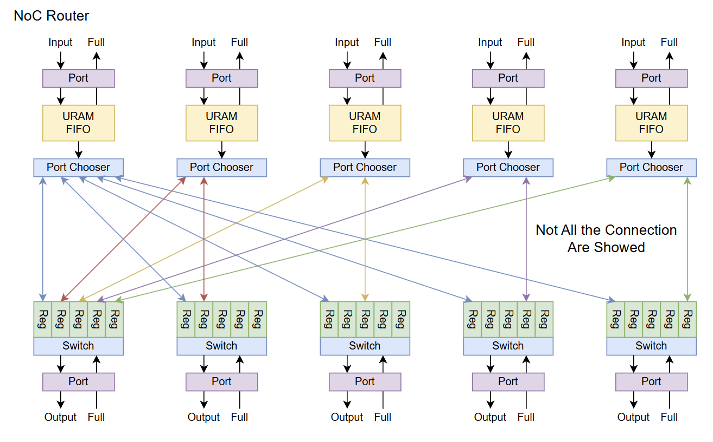
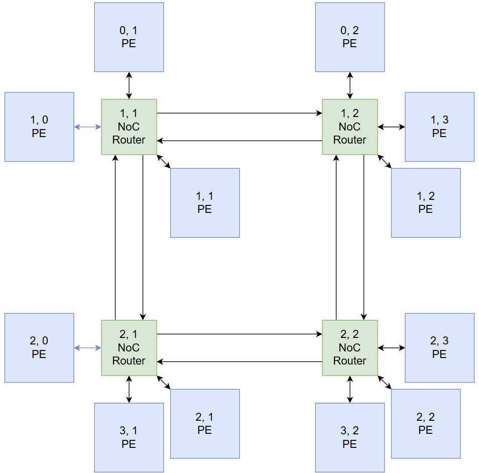

# NoC

In this project we implemented our own simple NoC for communication between Compute Unit and Control Unit.

## Motivation

When trying to design the bus system of our Arch. We find that AXI4-full is too heavy while AXI4-lite is too inefficient.

Which means we need to design a lightweight but fast bus system for our arch.

Since all of our compute unit will run in same or frequency divided by power of 2, we decide to design our own NoC system.

## Basic design

* Packet size: 144/216/288 bit, depends on how many URAM/BRAM you want to spend. we will choose at least 216bit for higher bandwidth.
* Router: 5port, north/east/south/west/local
* Same design of all port, you can connect PE on north/east/south/west porst as well
* Allow max `n*m + 2(n+n)` PE for `n*m` router mesh

| NoC Router Arch                                | 2D mesh example                                |
| ---------------------------------------------- | ---------------------------------------------- |
|  |  |

## Router

The router of our NoC is simple, we use URAM/BRAM FIFO for each input port, and each input port have its own "in-port-switch" to check which  output port should be assigned for current input.

While each out-port-switch will check if any in-port-switch give it valid data, once it get valid data and output port doesn't receive full/busy signal, it send the data and tell in-port-switch to "clean" the corresponding register.

This design is simple and efficient (less than 250LUT for single 288bit packet in-port-switch with round-robin (when multiple port available) + instant assign if only one port available + 1cycle throughput)

Also this design have artbitration and back-pressure.
