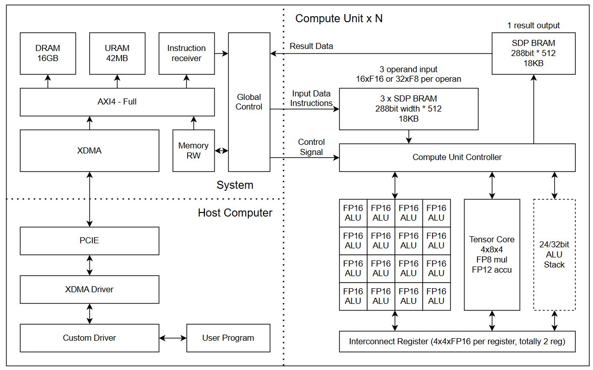

## Arch Design

### hierarchical arch overview

All top level components are connected with AXI4

* XDMA (PCIE connection with host)
* DRAM (weight or result)
* URAM (weight or result)
* BRAM (instructions)
* Global Controller
  * Compute Unit
    * Compute Unit Controller (instruction decode)
    * 4 BRAM for input/output register. (3 for operands 1 for output)
    * 1 Tensor Core (4x8x4 gemm, FP8mul FP12 acc)
    * 16 ALU (FP16 FMA, with FP12 inversion, log, exp as preprocess)
    * [Possible Feature] 1 general Core/CPU
      * Should support more complex operation
        * +-*, bit-wise operation, shift, high precision
      * possibly int8/int32/FP8/FP16/FP24/FP32 inp, int8/int32/FP16/FP32 out,
      * can use up to 16/32DSP if needed. (Can build iterative division implementation in pipeline direclty)

### ALU

#### FP16 ALU

In our FP16 ALU, we provide 3 input: A, B, C and 1 output
and the output will be f(A)*B+C, where f can be 1/x, exp(x) or log(x).
The f function here will truncate input to FP12 and output FP16.

#### General Processor

In our general processor, we will let it to support 2 input and 1 output
To achieve complex process, we put 4 or more compute stage into this processor, and each compute stage have 4 DSP.
Which means for things like division, exp, log, sqrt, this processor can achieve one cycle throughput with iterative methods (such as newton method).
Also this processor should support different dtype. (But basically just int32 and fp32, with type conversion at input and output stage)
